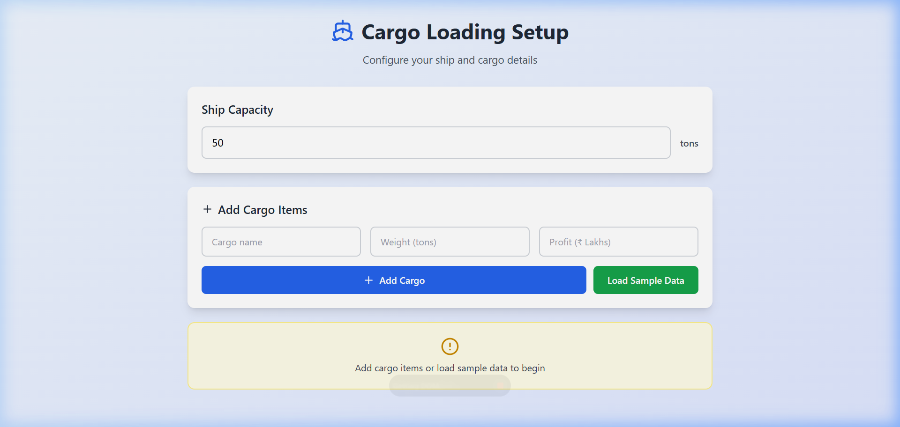
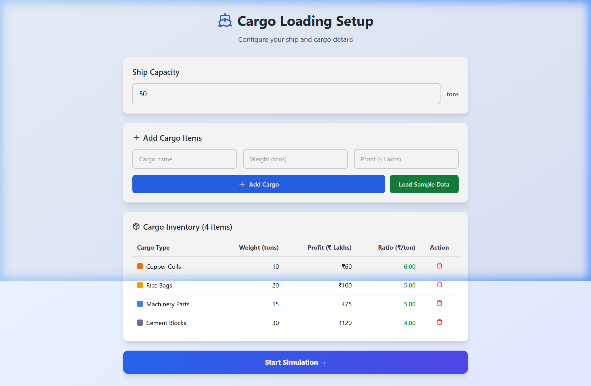
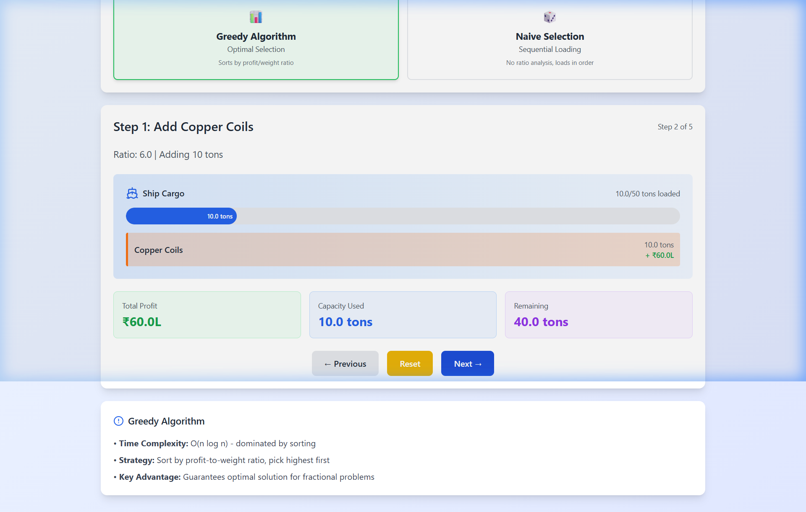
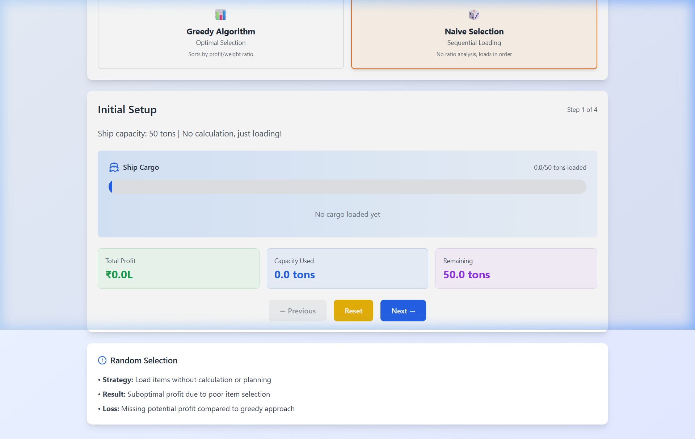
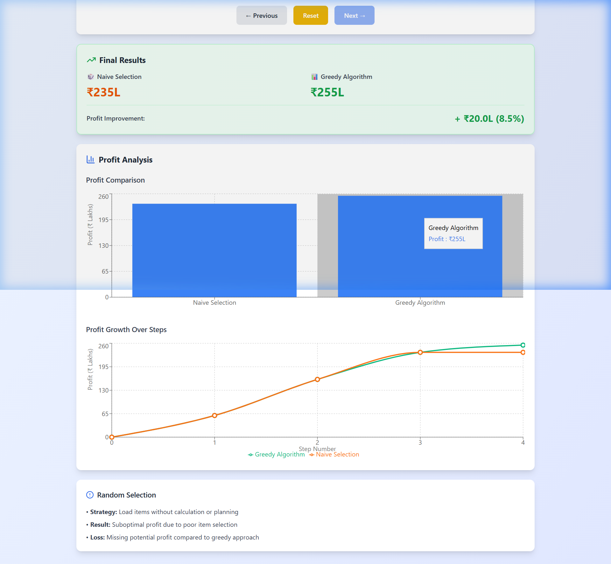

# 📦 Fractional Knapsack Visualizer

> **Coding Skills Project — 2nd Year | Section C**
> SRM University, AP | B.Tech CSE

[](https://coding-skills-project-2nd-year.vercel.app/)
[](https://vercel.com)

---

## 🌐 Live Demo

🔗 **[https://coding-skills-project-2nd-year.vercel.app/](https://coding-skills-project-2nd-year.vercel.app/)**

The project is deployed on **Vercel** — no setup needed, just open the link and start exploring!

---

## 📸 Screenshots — App Walkthrough

### 1️⃣ Home — Cargo Loading Setup
> The landing page where you configure the ship capacity and add cargo items.



---

### 2️⃣ Inventory — Sample Data Loaded
> After clicking **"Load Sample Data"**, four cargo items appear with their weight, profit, and profit-to-weight ratio pre-calculated.



---

### 3️⃣ Simulation — Greedy Algorithm in Action
> Step-by-step simulation of the **Greedy Algorithm** — picking items with the highest ratio first. The ship's cargo bar fills progressively.



---

### 4️⃣ Simulation — Naive Selection Approach
> The **Naive Selection** strategy loads items in their original order without any ratio analysis, resulting in suboptimal profit.



---

### 5️⃣ Final Results — Profit Comparison & Charts
> At the end of the simulation, a **Final Results** panel shows the profit difference, followed by a **Bar Chart** and a **Line Chart** comparing both approaches step-by-step.



---

## 📌 About the Project

The **Fractional Knapsack Visualizer** is an interactive web application that demonstrates and compares the **Greedy Algorithm** against a **Naive (Sequential) Selection** approach for solving the classic Fractional Knapsack problem.

The project is built as an educational tool to visually walk through each step of both algorithms side-by-side — showing how the Greedy approach consistently achieves a higher profit by prioritizing items with the best profit-to-weight ratio.

---

## 🧠 Algorithm Overview

### ✅ Greedy Algorithm (Optimal)
- Calculates the **profit-to-weight ratio** for every item
- Sorts items in **descending order** of the ratio
- Picks items greedily — taking the full item if capacity allows, or a **fraction** of it if not
- **Time Complexity:** O(n log n) — dominated by sorting
- **Guarantees the optimal solution** for the Fractional Knapsack problem

### ❌ Naive Selection (Suboptimal)
- Loads items in the **original input order**, without any ratio analysis
- No sorting or optimization applied
- Results in a **suboptimal profit** due to poor selection order
- Used as a **baseline for comparison** to highlight the advantage of the Greedy approach

---

## 🎯 Features

- 🚢 **Custom Input** — Set knapsack capacity and add items with name, weight, and profit
- 📋 **Sample Data** — One-click load of predefined cargo items for quick demo
- 🔄 **Step-by-step Simulation** — Navigate through each loading step for both algorithms
- 📊 **Profit Comparison Bar Chart** — Visual comparison of final profits
- 📈 **Profit Growth Line Chart** — Step-by-step profit accumulation for both approaches
- 🏆 **Final Results Panel** — Percentage improvement shown by the Greedy algorithm

---

## 🛠️ Tech Stack

| Technology | Purpose |
|---|---|
| React 19 + TypeScript | UI framework and type safety |
| Vite 7 | Lightning-fast dev server and bundler |
| Tailwind CSS 3 | Utility-first styling |
| Recharts | Bar chart and line chart visualizations |
| Lucide React | Icon library |
| Vercel | Deployment and hosting |

---

## 🚀 Getting Started Locally

### Prerequisites
- Node.js (v18 or above)
- npm

### Installation & Run

```bash
# Clone the repository
git clone https://github.com/Bhaumik1904/Coding-Skills-Project-2nd-Year.git
cd "Coding-Skills-Project-2nd-Year"

# Install dependencies
npm install

# Start the development server
npm run dev
```

Open your browser and navigate to **http://localhost:5173/**

### Build for Production

```bash
npm run build
```

---

## 📂 Project Structure

```
Fractional Knapsack/
├── src/
│   ├── FractionalKnapsackDemo.tsx   # Main component — all algorithm logic & UI
│   ├── App.tsx                      # Root app entry
│   ├── App.css                      # App-level styles
│   ├── index.css                    # Global styles
│   └── main.tsx                     # ReactDOM render entry
├── index.html
├── package.json
├── tailwind.config.js
├── vite.config.ts
└── tsconfig.json
```

---

## 👥 Team Details

| Name | Enrollment Number |
|---|---|
| Bhaumik Hinunia | AP24110010182 |
| Manya Srivastava | AP24110010171 |
| Vardhana Paluvai | AP24110012136 |
| Jayanti Yadav | AP24110010132 |
| Vijithendra Nagabhyru | AP24110010184 |

**Course:** Coding Skills
**Year:** 2nd Year
**Section:** C

---

## 📄 License

This project was developed as part of an academic course submission at **SRM University, AP**.
